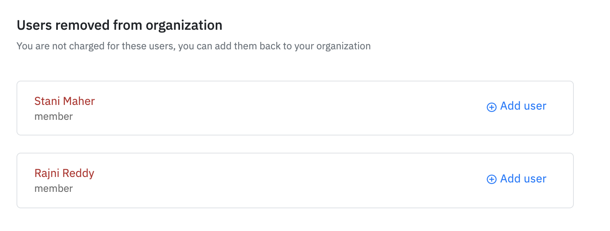

# Removing team members

## How to remove team members?

On your [team settings panel](https://app.spike.sh/settings/team), you will have the option to remove any **member** from your organization. Removing them would affect the escalation policies they are part of. Our dashboard will show you the number of escalations that could get affected along with the open incidents that the member is assigned to right now. Once removed, no alerts will be sent to this member.

### How are escalation policies affected?

The user gets automatically removed from all escalations policies they are part of. So, if a escalation has two users A and B wherein the first alert goes to A and 20 minutes later the second alert goes to B; if you choose to remove A then the escalation policy will always send only one alert immediately to B.


If the escalation policy only has only this team member then that policy will never come into affect. We recommend you edit that policy by adding alerts to other team members instead of creating a new one.


### How are assigned open incidents affected?

Incidents which are not resolved are open incidents. If there are any open incidents assigned then we recommend you assign them to someone else from your team. Alerts about only these incidents are sent to the user after they are removed too. _So, we suggest you reassign them soon as this member is removed._


Billing is adjusted from the next month cycle based on number of max team members from your organization using Spike.


## Can I add the same member back again?

Yes, we give you the option to add this same member back again. However, you will have to add them again to escalation policies and re-assign them incidents.

_Remember that this is not the same as undo-ing the removal of a member_

