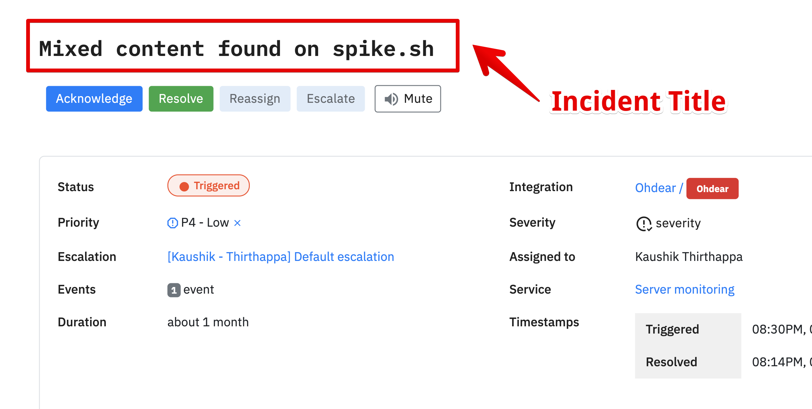

# Alert rules

## What are Alert rules?

Alert rules help you route alerts efficiently and correctly for every incident. Setup specific conditions to either ignore an incident or assign it to a different member / escalation policy. One that's right for the incident.

Visit the Alerts section from the sidebar and create a new alert rule. 


Don’t see this option? Contact us and we will enable it on your account.


## **Conditions**

You can create a group of conditions with an AND/OR clause. If any single block of condition(s) evaluates to True then we will execute the actions. But first, let's take a look at all the conditions -

### 1. Incident title

Evaluates to True if an incident title **contain/does not contain/equals/does not equal** a specific text or phrase

### 2. Incident details 

Evaluates to True if a specific key in incident details **contain/does not contain/equals/does not equal** a specific text or phrase. You will need to enter a specific key or nested key to compare with the text/phrase.

### 3. Occurrence

Evaluates to True if the total incident occurrences crossed a specific threshold.

### 4. Occurrences within a timeframe

Evaluates to True if incident occurrences cross a specific threshold in a given timeframe

### 5. Priority

Evaluates to True if incident has a given priority. [Learn more about priority](https://docs.spike.sh/incidents/priority-and-severity#priority)

### 6. Severity

Evaluates to True if incident has a given severity. [Learn more about severity](https://docs.spike.sh/incidents/priority-and-severity#severity)

## Actions

You can set one or more actions to execute

### 1. Reassign incident

to anyone from your team on Spike.sh. An email is sent to the assignee.

### 2. Change escalation policy

Instead of having to load the default escalation policy, you can change it dynamically with this action. For High severity incidents, load an escalation policy with everyone in it and for low priority incidents redirect them to Slack or MS Teams.

### 3. Do not create an incident

Not all incidents are major. Some are just not worth ending up on the dashboard or any alert channel.

### 4. Priority

Assign the incident a Priority. [Learn more about priority](https://docs.spike.sh/incidents/priority-and-severity#priority)

### 5. Severity

Assign the incident a Severity. [Learn more about severity](https://docs.spike.sh/incidents/priority-and-severity#severity)

## Applying multiple rulesets

For an incident, multiple alert rulesets can also be applied. Consider the below example -

.png>)

.png>)

According the above two alert rulesets, If an incident title contains **syslog** in it then the incident will be marked as **P5 priority** and subsequently, the escalation policy will also change to **Slack dev** (ref: Alert ruleset 2)


No more than 5 alert configs will be applied to a single incident


