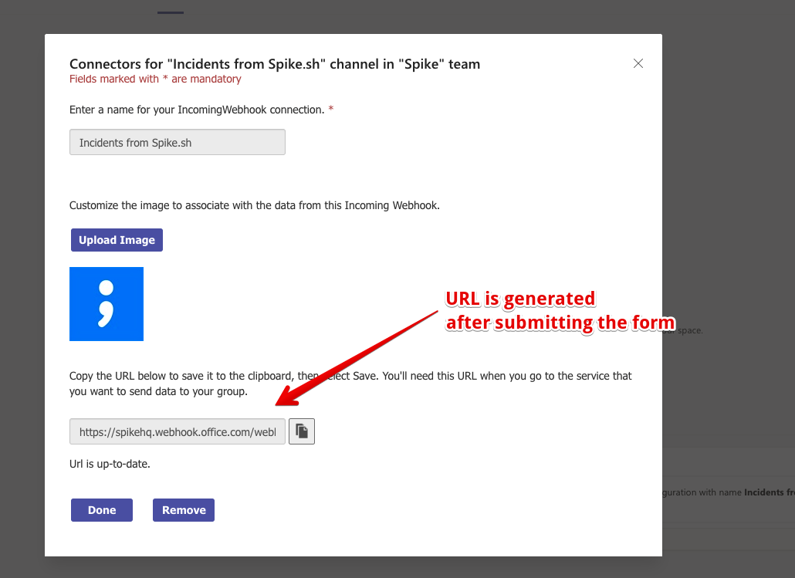

# Microsoft Teams

## Get Teams alerts from Spike.sh

The alert messages on Microsoft Teams (referred to as Teams from here on) comes with gists for you and your team to quickly learn about the incident.&#x20;

.png>)

## How to set up Teams?

**Step 1 - Setup incoming webhook**

Go to the Apps section in your teams account and install the **Incoming Webhook** app (created by Microsoft).

Select a channel of your choice and click **setup connector**

****

Name your connector and upload our Spike.sh logo so as to easily identify alerts coming from us. [You can download our logo here.](https://drive.google.com/drive/u/1/folders/1o1JwoMXVY9uYUb8v12wZOMUhaaxVLHnH)

**Step 2 - Paste the URL on Spike.sh**

Head over to Spike.sh dashboard and visit [settings > organisation](https://app.spike.sh/settings/organisation) and create a Teams integration by giving a friendly name along with the URL you copied from step 1.


Make sure to paste the exact URL from above. Any changes in the URL might result in missing alerts


.png>)


Once integrated, we will send a sample alert to your configured Teams channel


A friendly name will help you identify this integration while creating escalation policies. Like below -&#x20;

.png>)

You can create multiple Teams integrations with different incoming webhooks configured on Teams.&#x20;


Our MS Team alert channel accepts inputs from you to acknowledge or resolve an incident.


### Possible Caveats

We have noticed that in some MS Teams account, **acknowledge** and the **resolve** buttons fail.

.png>)

It could be possible because the connector is disabled in your tenant setting access list. Another possible cause for this could be that you are using a legacy account.

Here are few links that might help you understand why it happens.\
1\. [Github issue](https://github.com/MicrosoftDocs/msteams-docs/issues/1221)

