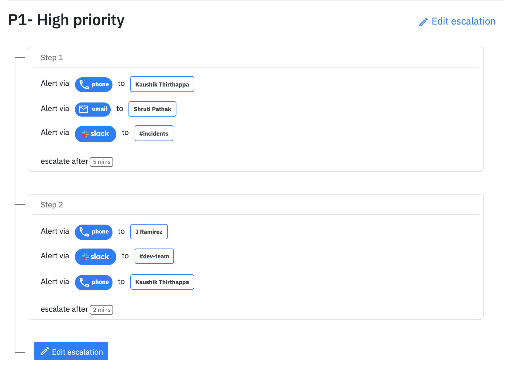

# Incident lifecycle

## Incident lifecycle

Incidents can have one of these statuses - 

1. **Triggered**
2. **Acknowledged**
3. **Resolved**

_Learn more about what these states in the next page_

### 1. Triggering incidents

Your added integrations will create an incident on Spike. Every integration on one or more services are treated uniquely. This would mean that you can have multiple AWS integrations and they will all be treated uniquely to make sure that incidents are triggered. 

Before the incident is created, Spike checks for similar incidents for this integration. If it exists then _a new incident is not created but an event is logged for the same incident which is not resolved._


**Avoiding duplication of incidents**.

Similar incidents in resolved state are ignored. Only the incidents which are **open (acknowledged or triggered state)** will be checked.


### 2. Automatic escalations

On Spike, you have the freedom to assign a separate escalation policy to each of your integration. This gives you the flexibility to operate with ease knowing which alerts to prioritise over others.

Spike alerts based on the escalation policy. For the newly created incident, the first alert is sent in the order of responders in the policy. In the above example, the first alert is being sent to the **Slack channel #incidents **along with alerting dev member Kaushik and email to another member.

Spike waits for 5 minutes for the any of the responders to acknowledge or resolve the incident. If there is no action taken, spike automatically escalates and alerts the responders on the next level. 

In the above examples, there are 2 responders who will be alerted via phone, also at the same time we alert to **Slack channel #dev-team**.  

### 3. Acknowledge timeout

For every integration, you can choose a set a timeout for incidents acknowledged but not resolved. After this timeout, Spike resumes the escalations and start sending alerts to the next escalation level. If it's the end of escalation then it's repeated automatically. 

