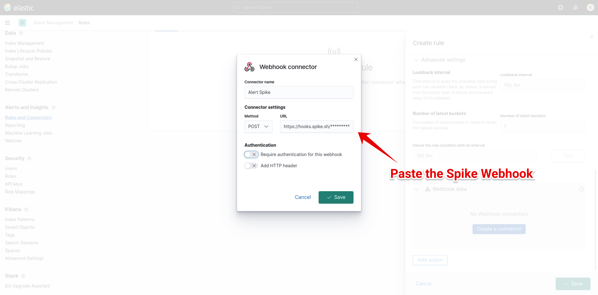
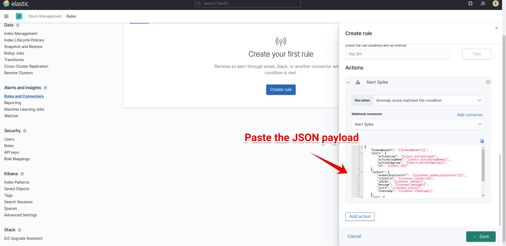

# Integrate Spike with Elastic Cloud

### Service and integration <a id="service-and-integration"></a>

Make sure to add the Elastic Cloud integration and copying the webhook.




### Using Webhooks with Elastic Cloud

**Step 1**

In the alerts and insights section, navigate to rules and connections. Then create a new rule.


**Step 2**

While creating a rule, select the webhook action.


**Step 3**

Paste the Spike webhook URL and save.




**Step 4**

Paste the JSON payload provided below for the webhook action.




```text
{
	"kibanaBaseUrl": "{{kibanaBaseUrl}}",
	"alert": {
		"actionGroup": "{{alert.actionGroup}}",
		"actionGroupName": "{{alert.actionGroupName}}",
		"actionSubgroup": "{{alert.actionSubgroup}}",
		"id": "{{alert.id}}"
	},
	"context": {
		"anomalyExplorerUrl": "{{{context.anomalyExplorerUrl}}}",
		"isInterim": "{{context.isInterim}}",
		"jobIds": "{{context.jobIds}}",
		"message": "{{context.message}}",
		"score": "{{context.score}}",
		"timestamp": "{{context.timestamp}}"
	},
	"rule": {
		"id": "{{rule.id}}",
		"name": "{{rule.name}}",
		"tags": "{{rule.tags}}",
		"type": "{{rule.type}}"
	}
}
```

