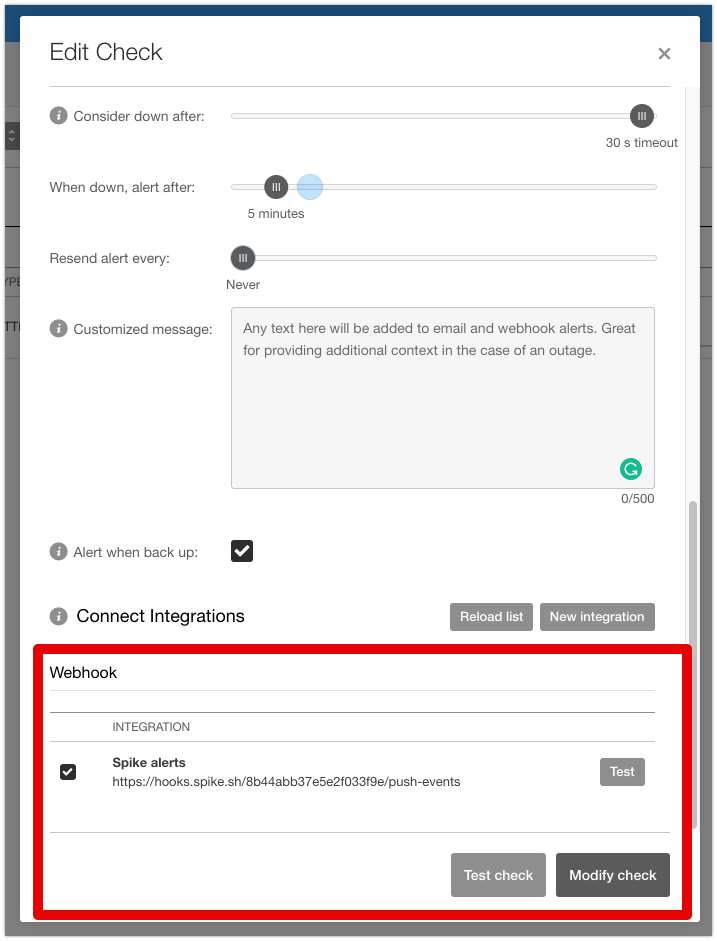

# Integrate Spike with Pingdom

## Service and Integration

Make sure you have the service and integration already setup for Pingdom. Follow the link below on instructions of how to create integration and service



## Use the webhook on Pingdom

Login to [pingdom](https://my.pingdom.com) and navigate to [Integrations page](https://my.pingdom.com/integrations/settings). 

You can choose to edit or add a new one. Enter the webhook you copied in the above step.

Once you have saved it, you can use this for all monitoring. For uptime checks, navigate to the [uptime section](https://my.pingdom.com/newchecks/checks) under **Experience monitoring.**

Select one or more checks and edit to select the webhook at the bottom of the modal. 

> You can choose to test the webhook but note that it will create a new incident.

## FAQ

1. **How many services and integrations can I create on Spike?**
   * Unlimited
2. **How many escalation policies can I have on Spike?**
   * Unlimited

At Spike, we are working hard to integrate with all the tools your business uses. We are on a mission to help **you** identify incidents/crashes/spikes before your customers do.

If you have any integration in mind and would like us to build it for you then contact us at [support@spike.sh.](mailto:support@spike.sh)

