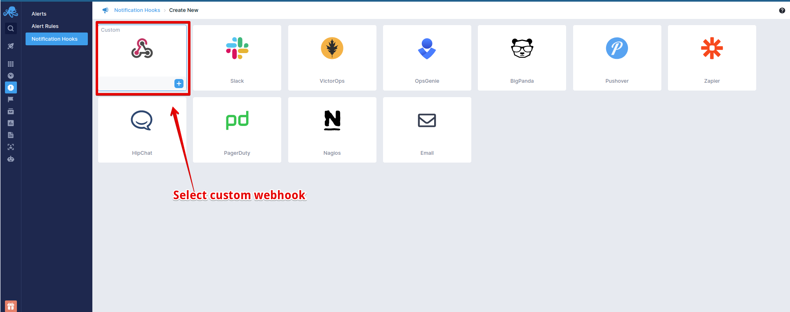
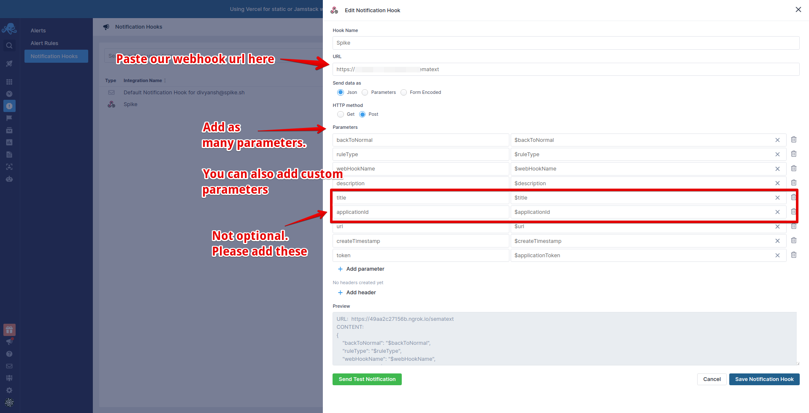

# Integrate Spike with Sematext

## Service and integration

Create a new Sematext integration. Follow the steps in the link below to create a service and integration.


[create-integration-and-service-on-dashboard.md](create-integration-and-service-on-dashboard.md)


###

### Using the webhook on Sematext

### Step 1

From the [Sematext Hook](https://apps.sematext.com/ui/hooks) dashboard, **Create New** alert.


### Step 2

From the list of options, select **Spike.sh**.&#x20;




### Step 3

You will be now displayed with a configuration panel.

Paste your **Spike webhook** in the URL field

```
// Make sure to add the following parameters and any other variables you deem fit

$description
$title

```

You can also add custom variables for more in-depth information about the alert.

Finally, **Save notification hook.**



At Spike, we are working hard to integrate with all the tools your business uses. We are on a mission to help **you** identify incidents/crashes/spikes before your customers do.

If you have any integration in mind and would like us to build it for you then contact us at [support@spike.sh.](mailto:support@spike.sh)
