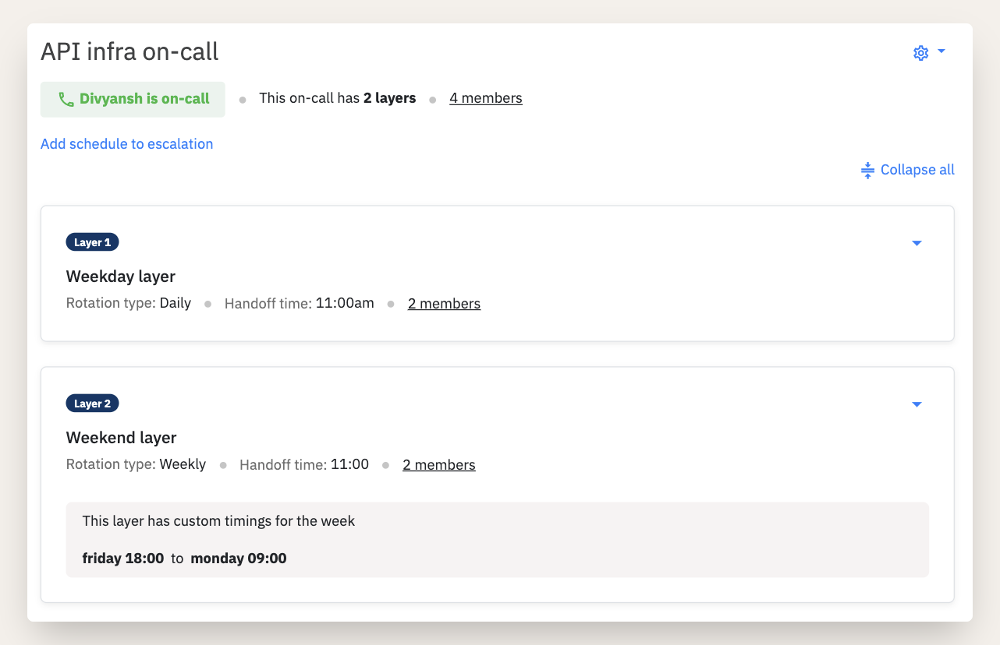

# Introduction to Layers in on-call schedules

## What are Layers in on-call schedules?

Layers are schedules with the same key components as members, handoff, rotation and slots. You can add multiple layers to one on-call schedule. This helps you give flexibility over timings and members.&#x20;

Layers for your on-call schedule are organised sequentially in ascending order. This means when timing overlaps between Layer 2 and Layer 1, the higher layer will overlap the lower ones, i.e. in this case **Layer 2 will overlap 1.**&#x20;

For 3 layers, Layer 3 will take overlap over 1 and 2.&#x20;


Every on-call schedule will have at least one layer


### What does overlapping mean?

In simple words - if both layers have common times then Layer 2 will overlap calendar schedules from layer 1. Let's take an example.&#x20;

### Understand layers with an example

Here is a simple on-call schedule with 2 members rotating each day. This means one of the members is on-call every day covering for the entire week.&#x20;

**All days -** Daily rotation among 2 members&#x20;

This is how the calendar looks like with just the above layer in our on-call schedule

.png>)

### Adding the weekend layer to override

Now, this could be too much to handle. How about we give them a break over the weekend and ask other members to help out.&#x20;

To enable this, we can add another layer with weekly rotation among members who only need to be on-call **from Friday 6 PM to Monday 9 AM**

**Weekdays -** Daily rotation among 2 members \
**Weekends** - One person for the entire weekend rotating weekly

Members from Layer 1 will be on-call every alternate day, on all weekdays and members from Layer 2 will be on-call for the entire alternate weekend (since weekly rotation has been applied).&#x20;

This is how the calendar looks with both layers.&#x20;

.png>)

### **How did overlapping work here?**

Members from Layer 2 will overlap the scheduled on-call from Friday 6 PM to Monday 9 AM.&#x20;


If the weekend layer was Layer 1 and the weekday layer was Layer 2 then the weekend layer would have never come to effect. **There are no limits on number of layers to be added on a single on-call schedule**


You can start experimenting with layers by editing the same schedule as many times as you want.&#x20;

### FAQs on Layers

* **Can I add a layer temporarily?**
  * You can add a layer and then delete it. A common use case if a person needs to take the day off and someone else has agreed to cover them, then add a new layer to cover that day alone. Once the day is passed, delete the layer.&#x20;
* **How many layers can I add?**
  * There is no limitation. Our recommendation is to avoid adding too many layers. Otherwise, it could get confusing how the calendar works and as a result teams usually hesitate to delete any layer.&#x20;
* **How many members can be added in one layer?**
  * There is no limit here either.&#x20;

